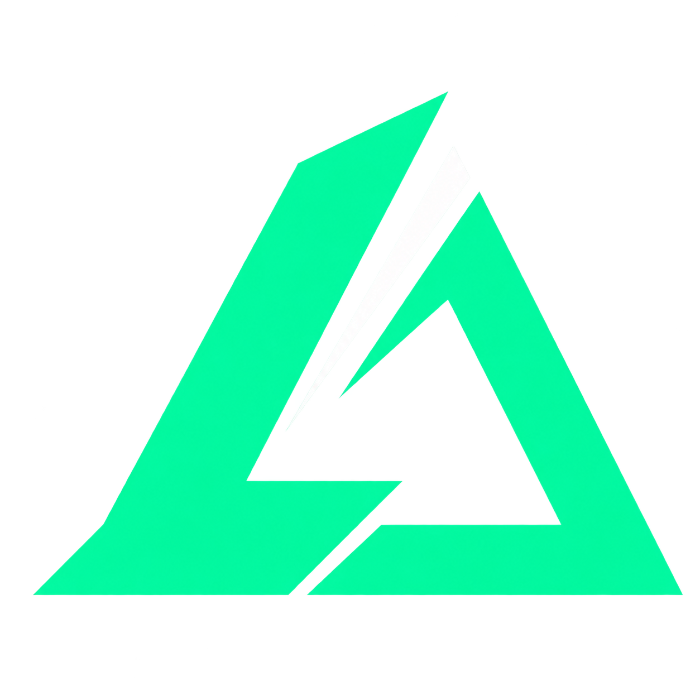

<p align="center"></p>

# LANDELTA

**Tus tiempos. Tu ritmo. Tu próxima mejora.**

Overlays de telemetría para **Assetto Corsa Competizione**, creados por **Lands** para Windows. Información legible, paneles compactos y fondos transparentes para conducir con los datos que necesitas.

**Beta 0.12 · Windows 10/11 x64 · C++17 · Sin cuenta ni suscripción**

> El proyecto está en desarrollo. Las pruebas de lógica usan transporte y ventanas simulados. No sustituyen una prueba de esta versión en ACC real bajo Windows.

## Descargar y empezar

Abre la [beta v0.12.0](https://github.com/Landsxd/landelta/releases/tag/v0.12.0) y descarga **LANDELTA-Windows-Beta.zip**. El ZIP automático **Source code** contiene el código; para jugar necesitas la descarga de Windows.

1. Extrae el ZIP en una carpeta fija y abre `LANDELTA.exe`.
2. La primera vez, mantén ACC cerrado para preparar su conexión local. Si no encuentra Documentos, usa **Conexión → Elegir carpeta de ACC**.
3. Abre ACC en **ventana sin bordes** y entra en pista.
4. Activa los paneles que quieras, ajusta su tamaño y posición y pulsa **Bloquear para conducir**.
5. Para iniciar con Windows, usa **Inicio → Activar**. La app espera junto al reloj y muestra los overlays al detectar una sesión.

¿Vienes de Vortex? Sal de la copia anterior desde su icono de bandeja antes de abrir LANDELTA. Los ajustes y el historial se conservan. Si usabas inicio automático, vuelve a pulsar **Inicio → Activar** para actualizar la ubicación del EXE.

## Qué puedes ver

| Panel | Datos |
| --- | --- |
| **CLASI** | Clasificación, pilotos, mejores vueltas y avisos de penalización. |
| **REL** | Autos próximos delante y detrás en pista, incluidos doblados. |
| **Vuelta / sectores** | Vuelta actual y S1/S2/S3 en vertical, con minutos y milésimas. |
| **Pedales** | Barras de acelerador y freno, sin porcentajes. |
| **Delta** | Diferencia por punto de pista frente a tu mejor vuelta limpia observada; referencia de ACC mientras se aprende. |
| **Últimos sectores** | Las dos últimas vueltas frente a la mejor limpia anterior. |
| **Ritmo / alcance** | Ritmo de rivales y estimación de alcance a partir de vueltas limpias observadas. |
| **Historial** | Circuitos, sesiones y vueltas guardados en una pestaña de la app. |

Los paneles son independientes. Puedes moverlos, cambiar tamaño y opacidad, y apagar los que no necesites. Los espacios sin información permanecen transparentes.

## Delta y conexión

**Δ MEJOR** necesita una vuelta limpia completa observada desde su inicio con la app abierta. Compara el tiempo al pasar por el mismo punto del circuito, interpolando entre muestras. Una vuelta iniciada antes de abrir la app no sirve como referencia completa. Verde y negativo: ganas tiempo; rojo y positivo: lo pierdes.

**Δ ACC** usa la referencia que envía el juego mientras no existe una local. **SIN REF.** indica ausencia de referencia, no una diferencia de cero. Las vueltas inválidas y de boxes no crean una referencia; cambiar sesión, circuito o auto la reinicia.

Tu auto utiliza memoria compartida local. Los demás pilotos llegan mediante el protocolo de broadcasting de ACC, tanto en sesiones offline como online cuando el juego los transmite. Si ves tus tiempos pero faltan pilotos, cierra ACC, pulsa **Conexión → Reparar conexión de pilotos** y abre ACC de nuevo.

Los relativos, gaps de carrera y predicciones marcados con `~` son estimaciones. `PEN` confirma una sanción del jugador; `!` es un aviso recibido y no confirma una sanción pendiente de otro piloto.

## Atajos

| Atajo | Acción |
| --- | --- |
| `Ctrl + Alt + F10` | Bloquear / desbloquear paneles. |
| `Ctrl + Alt + F11` | Mostrar / ocultar overlays. |
| `Ctrl + Alt + F12` | Abrir el control. |

Cerrar con **X** deja la app en segundo plano. Para terminarla, usa el icono junto al reloj → **Salir de LANDELTA**. **Mostrar overlays al entrar en sesión** viene activado; una sesión nueva vuelve a mostrar los paneles habilitados.

## Reportar un problema

Abre un **Issue** con la plantilla de bug. Indica versión, circuito, modalidad, si era online u offline, pasos y qué esperabas ver. Puedes generar el diagnóstico desde **Conexión → Diagnóstico**; revisa y elimina tu nombre de usuario o rutas personales antes de adjuntarlo.

No hace falta publicar tu `broadcasting.json`, contraseñas ni tu historial completo. La app guarda los datos localmente y no envía tu telemetría a internet.

## Compilar y contribuir

Instala [MSYS2](https://www.msys2.org/) y abre su terminal **UCRT64**:

```bash
pacman -S --needed mingw-w64-ucrt-x86_64-gcc
MSYS2_ARG_CONV_EXCL='*' cmd.exe /c build-windows.bat
```

El resultado es `LANDELTA.exe` en la raíz del proyecto. El ejecutable distribuido no requiere Python ni .NET.

- [Guía de contribución](CONTRIBUTING.md)
- [Instrucciones completas de uso](LEEME.txt)
- [Cambios de la beta 0.12](CAMBIOS-0.12.txt)
- [Qué se ha validado y sus límites](VALIDACION.txt)
- [Cómo publicar la beta](docs/PUBLISHING.md)

El flujo de GitHub Actions incluye pruebas de lógica e integración simulada en Linux y compilación en Windows. La [primera publicación de la beta](https://github.com/Landsxd/landelta/actions/runs/37895981404) superó ambos trabajos y la verificación de sus descargas. Compilar correctamente no certifica por sí solo una carrera real.

## Créditos

Desarrollo: **Lands**. Nombre anterior: Vortex ACC Overlay.

Las dependencias conservan sus avisos en [`vendor/JSON-LICENSE.txt`](vendor/JSON-LICENSE.txt) y [`licenses/`](licenses/). Proyecto independiente, sin afiliación con Kunos, Assetto Corsa Competizione, RaceLab ni SRO.

### Delta e imágenes del historial

En **Paneles**, usa **Delta − / +** (50–250%) o la rueda sobre el delta desbloqueado. El tamaño general también se aplica. Activa **Fuera de sesión** para ver los paneles sin modo demo; el delta conserva el último dato como **Δ FIN**. F11 sigue permitiendo ocultarlos.

En vueltas inválidas, el delta sigue comparando: mejora amarilla, pérdida roja. La referencia propia siempre procede de una vuelta limpia.

En **Historial → Circuito → Sesión → Exportar PNG**, elige dónde guardar todas las vueltas y sectores. Las sesiones de más de 40 vueltas se dividen en imágenes numeradas.
